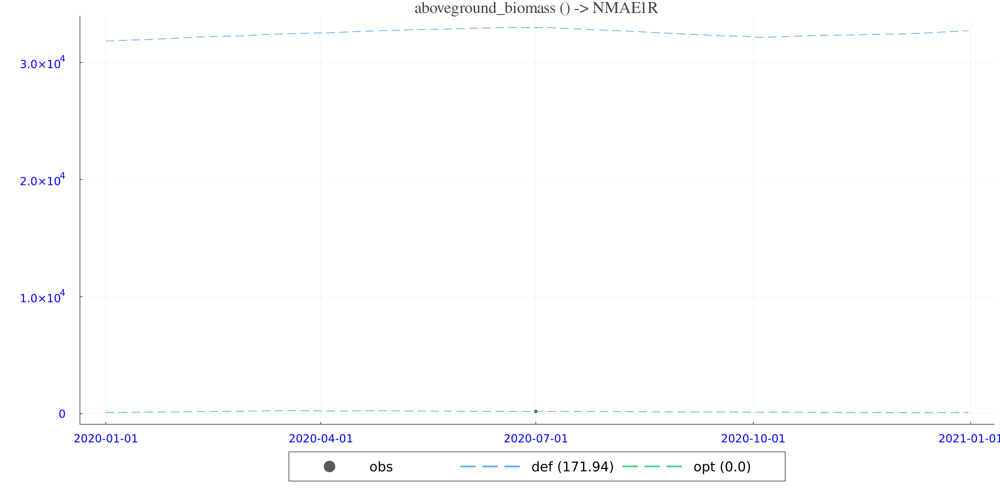
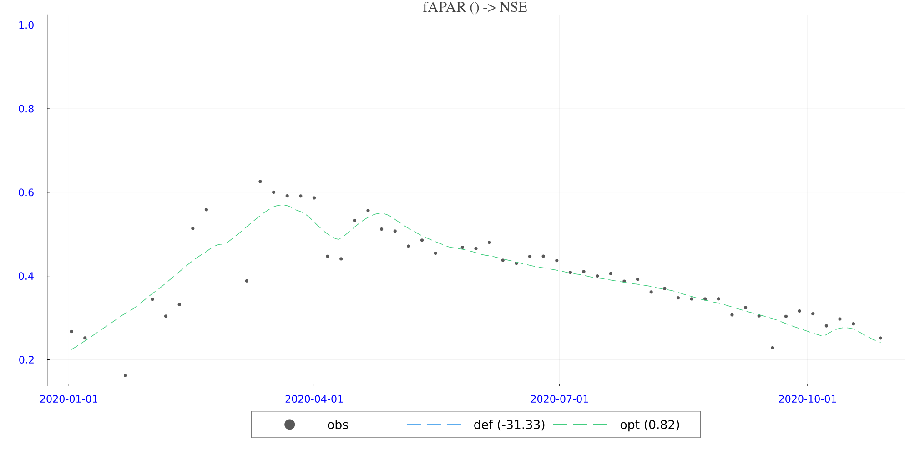

# SINDBAD running for `SCS3: Model-Data Fusion for Understanding Carbon State-Flux Relationships Across Space` in the EO-LINCS project

A notebook by Xu Shan, Sujan Koirala

## 1. Introduction

This study addresses a central scientific question: can Earth Observation (EO)–derived products be integrated into a process-based terrestrial ecosystem model to better constrain key parameters and improve the representation of vegetation carbon dynamics? Specifically, we investigate whether EO observations of forest carbon state and canopy function provide complementary information that reduces uncertainty in model parameters and yields simulations that are more consistent with observed ecosystem behavior.

Specifically, we focus on two EO products which observe and retrieve the states of carbon amount of vegetation, including the carbon amount, and phenology:

- a) Aboveground Biomass (AGB), representing the amount of dry carbon stored in vegetation (carbon stock). In this deliverable, AGB is retrieved from active microwave remote sensing products (e.g., ESA CCI Biomass).
- b): Fraction of Absorbed Photosynthetically Active Radiation (fAPAR) or Normalized Difference Vegetation Index (NDVI), representing canopy light absorption linked to photosynthetic capacity and phenology. Here, NDVI is derived from optical remote sensing products (e.g., Sentinel-2).

On the modeling side, we use a process-based carbon cycle model that represents (i) carbon uptake through photosynthesis, (ii) carbon losses via autotrophic and heterotrophic respiration, and (iii) carbon allocation and turnover among vegetation pools (e.g., leaf, stem, and root). The model is driven by meteorological forcing and produces time series of carbon fluxes and states, including variables related to carbon density and phenology (AGB, fAPAR).
Here fAPAR is constrained by NDVI observations to constrain the seassonal dynamics of vegetation phenology. NDVI is linked to fAPAR via a simple linear relationship. We acknowledge that fAPAR is not NDVI, but several studies indicate that there exists a strong linear relationship between fAPAR and NDVI [[Myneni et al., 1994](https://www.sciencedirect.com/science/article/pii/0034425794900167)], which is commonly used in remote sensing and land surface modeling and data assimilation [[Forkel et al., 2019](https://www.nature.com/articles/s41598-019-55187-7)]. NDVI is used instead of a direct fAPAR product because it is directly derived from Sentinel-2 reflectance data, avoiding the additional uncertainty associated with fAPAR retrievals.

Our hypothesis is: We assume that AGB (microwave-based) and NDVI (optical-based) can be assimilatd jointly to constrain parameters controlling vegetation growth, allocation, and turnover, thereby improving simulated vegetation dynamics. In particular, AGB primarily constrains long-term carbon accumulation and pool sizes, while fAPAR provides constraints on seasonal phenology. We also assume a linear relationship between NDVI and modeled fAPAR, which is a common assumption in remote sensing and land surface modelling of vegetation.

Here we use the EO-LINCS cube generation pipeline to generate the input data for the model-data integration experiment, and use the SINDBAD framework to perform the parameter inversion. Two pipelines are run over one eddy covariance FLUXNET site AU-Dry in year 2020. EO-LINCS provides a comprehensive pipeline to unify the download process of EO data about carbon states (ESA CCI AGB and Sentinel 2 NDVI) and meteorological drivers (ERA5-Land), and process them into a consistent format for model-data integration. This makes users run the whole process much more efficiently and easily by combing EO-LINCS cube generation pipleline and SINDBAD model-data integration framework. This notebook demonstrates how to set up and run the model-data integration experiment using SINDBAD, with the input data generated from EO-LINCS cube generation pipeline. The workflow shows a scientific case to demonstrate how EO-LINCS bring novel EO data products about carbon cycle into model-data integration framework, and how the integration of EO data can help to constrain model parameters and improve the representation of vegetation carbon dynamics.

## 2.Methodology

---
### 2.1 SINDBAD

[SINDBAD](http://sindbad-mdi.org/) is a model-data integration framework for terrestrial carbon-water processes [[Koirala et al., in prep.](https://essopenarchive.org/users/551954/articles/1271244)]. Is built in Julia with a view on speed and differenciability for the development of representation of processes and responses of ecosystem functioning to meteorological conditions and changes in climate. Sets on the concept of modularity to formaly test hypothesis on the representation of processes / models ($f(X,\theta)$), for given observational constraints ($Y$) and drivers ($X$) of the carbon and water dynamics in terrestrial ecosystems. Modularity is extended to the initial condition problem ($\text{x}^*_0$), cost functions ($\mathcal{L(\theta)}$) and optimization algorithms ($\mathcal{O}$). SINDBAD integrates machine learning for enhancing the representation of processes in mechanistically-inspired models, hybrid modeling [Reichstein et al., 2019], by learning ML-based parameterizations [e.g. Bao et al., 2024], paving way for process abstraction [Son et al., 2024].

---
### 2.2 WROASTED: a Simple Coupled Carbon–Water Ecosystem Model

The carbon dynamics,  $\frac{dC}{dt}$, are simulated as the difference between gross assimilation and respiratory fluxes

$$
\frac{dC}{dt} = GPP - R_{ECO}
$$

where ${GPP}$, gross primary productivity, results from photosynthetic activity and $R_{ECO}$, ecosystem respiration, is the sum of autotrophic and heterotrophic respiratory fluxes, namely, $R_{A}$ and $R_{H}$.

$R_{A}$ integrates both maintenance and growth respiration, $R_{M}$ and $R_{G}$, where  $R_{M}$  can be generically written like:

$$
R_{M} =\sum_{i=1}^{N} \tau_i \cdot C_i \cdot f_T
$$

$i$ representing the different carbon pools ($C_i$) in vegetation - root/wood/leaf/reserves; $\tau_i$ the turnover rate of pool $i$ , and $f_T$ the temperature dependence of metabolic activity, usually a $Q_{10}$ function; while $R_G=Y_G \cdot GPP$, being $Y_G$ and constant growth efficiency parameter [see Amthor, 2001].

$R_H$ results from litter and soil decomposition:

$$
R_{H} =\sum_{i=1}^{N} \tau_i \cdot C_i \cdot f_T \cdot f_W
$$

$i$ representing the different heterotrophic carbon pools ($C_i$) in soils - fast and slow litter and organic carbon pools; $\tau_i$ the turnover rate of pool $i$ , $f_T$ and $f_W$ the temperature and soil moisture sensitivity of decomposition function.

Soil moisture dynamics, $\frac{dW}{dt}$:

$$
\frac{dW}{dt} = P_r - E_i - E_s - Q - D - T_r
$$

Being: $Pr$: precipitation; $E_i$: interception evaporation; $E_s$: soil evaporation; $Q$: surface runoff; $D$: drainage; $T_r$: plant transpiration.

Transpiration is tighly coupled to $GPP$, estimated as:

$$
GPP = min(GPP_D,GPP_S)
$$

Being demand $GPP$:

$$
GPP_S = \epsilon^* \cdot f\text{APAR} \cdot \text{PAR} \cdot (f_L \cdot f_{CI} \cdot f_T \cdot f_{VPD} \cdot f_W)
$$

The product between: maximum light use efficiency, $\epsilon^*$; the fraction of photosynthetically active radiation, $\text{APAR}$, absorbed by leafs, $f\text{APAR}$; and the instantaneous effect of light intensity $f_L$, cloudiness index $f_CI$, vapor pressure deficit $f_VPD$ and soil moisture $f_W$ [see Bao et al., 2023; 2024].

And  supply $GPP$:

$$
GPP_S = PAW^{k_{Tr}} \cdot WUE
$$

Where where the daily variations in water use efficiency, $WUE$, result from changes in $VPD$ and $\quad [CO_2]_{atm}$. Upon $C$ assimilation by vegetation, and deduced $R_A$ costs, the available carbon is transported to the different vegetation pools depending on environmental conditions, as inspired by the growind season index (GSI) model [see Koirala et al., in print; Jolly et al., 2005].

Overall, WROASTED includes >40 parameters controlling the responses of carbon and water dynamics in terrestrial ecosystems constrainable by observations of ecosystem fluxes, eddy covariance, plant phenology from remote sensing EO data, and above ground biomass stocks, where available [see Koirala et al., in print]. These parameters are all used in SCS3.

---
### 2.3 Model-Data-Integration Framework

To calibrate and generalize the model parameterization.

---
#### 2.3.1 Parameter inversion

The goal is to find $\theta$ such that the model predictions $f(X, \theta)$ best match observed datasets $y$. Here, the terrestrial ecosystem model, WROASTED, represented by $f(X, \theta)$, predicts a set of ecosystem carbon and water state and flux variables, $\hat{y}$, observed at locations:

- $X$: meteorological drivers (i.e., temperature, radiation, precipitation, $VPD$, etc);
- $\theta$: parameter vector to be estimated;
- $y$: observations (e.g., $GPP$, $T_r$, evapotranspiration, $R_{ECO}$, aboveground biomass AGB, $f\text{APAR}$)

#### 2.3.2 Optimization problem

Generically can be written:

$$
\theta^*=\arg\min_{\theta \in \Theta} \; \mathcal{L}(\theta)\quad\text{via}\quad\mathcal{O}
$$

Where:
- $\mathcal{L}(\theta)$: is the cost function quantifying the mismatch between model predictions and observations,
- $\Theta$: feasible parameter space (e.g., bounds or priors on $\theta$),
- $\mathcal{O}$: optimization operator/algorithm (e.g., gradient descent, L-BFGS, CMA-ES)

In the exercise here, for fluxes and phenology time series, the loss function $\mathcal{L}(\theta)$ is set to the normalized Nash-Sutcliffe Efficiency (NNSE)

$$
\text{NNSE}(\theta) = 1 - \frac{1}{2-NSE}
$$

$$
\text{NSE}(\theta) = 1 - \frac{\sum_{i=1}^{N} (y_i - f(X_i, \theta))^2}{\sum_{i=1}^{N} (y_i - \bar{y})^2}
$$

While for stocks, AGB, an adjusted normalized mean average error is used

$$
NMAE = \frac{\sum_{i=1}^{N} |y_i - f(X_i, \theta)|}{N \cdot (1+ \bar{y})}
$$

$$
\theta^* = \arg\min_{\theta} \; \mathcal{L}(\theta)
$$

Here, a full list of parameter is shown in the following table:

| Parameter                                     | Meaning                                                                                   | Units     |
| --------------------------------------------- | ----------------------------------------------------------------------------------------- | --------- |
| rootMaximumDepth.constant_frac_max_root_depth | Root depth as a fraction of soil depth.                                     |           |
| rootWaterEfficiency.k_efficiency_cVegRoot     | Rate constant of exponential relationship.             | m2/gC     |
| treeFraction.constant_frac_tree               | Constant fraction of vegetation treated as tree cover.                                    |           |
| fAPAR.k_extinction                            | Canopy light extinction coefficient in Beer–Lambert fAPAR formulation.                    |           |
| snowMelt.melt_T                               | Temperature melt factor.                   | mm/°C     |
| snowMelt.melt_Rn                              | Radiation melt factor (controls melt sensitivity to net radiation).                       | mm/(W/m2) |
| runoffSaturationExcess.β                      | Linear scaling parameter to get the berg parameter from vegFrac.                   |           |
| evaporation.α                                 | α coefficient of Priestley-Taylor formula for soil.                                 |           |
| evaporation.k_evaporation                     | Fraction of soil water that can be used for soil evaporation.             |           |
| drainage.dos_exp                              | Exponent of non-linearity for dos influence on drainage in soil.                      |           |
| groundWRecharge.dos_exp                       | Exponent of non-linearity for dos influence on drainage to groundwater.          |           |
| transpirationSupply.k_transpiration           | Fraction of total maximum available water that can be transpired. |           |
| gppPotential.εmax                             | Maximum light-use efficiency for potential GPP.                                           | gC/MJ     |
| gppDiffRadiation.μ                            | Parameter controlling diffuse radiation effect on light-use efficiency.                   |           |
| gppAirT.opt_airT                              | Optimal air temperature for photosynthesis.                                               | °C        |
| gppAirT.opt_airT_A                            | Increasing slope of sensitivity.                       |           |
| gppAirT.opt_airT_B                            | Decreasing slope of sensitivity.                       |           |
| gppVPD.κ                                      | VPD sensitivity parameter reducing photosynthesis at high VPD.       | 1/hPa     |
| gppVPD.c_κ                                    | Scaling/offset parameter for the VPD stress function.                                 |           |
| gppVPD.sat_ambient_CO2                        | Saturated ambient CO₂ saturation level.                      | ppm       |
| gppSoilW.q                                    | Sensitivity of GPP to soil moisture.                       |           |
| gppSoilW.θstar                                | Optimal soil moisture threshold for GPP limitation.                              | m3/m3     |
| WUE.WUE_one_hpa                               | Baseline water using efficiency at 1 hPa VPD (or reference condition).                      |           |
| WUE.κ                                         | Parameter controlling water using efficiency sensitivity to VPD.                            | 1/hPa     |
| cCycleBase.c_τ_Root                           | Root carbon turnover rate.                                             |           |
| cCycleBase.c_τ_Wood                           | Wood/stem carbon turnover rate.                                        |           |
| cCycleBase.c_τ_Leaf                           | Leaf carbon turnover rate.                                             |           |
| cCycleBase.c_τ_LitFast                        | Fast litter turnover rate.                                             |           |
| cCycleBase.c_τ_LitSlow                        | Slow litter turnover rate.                                             |           |
| cCycleBase.c_τ_SoilSlow                       | Slow soil carbon turnover rate.                                        |           |
| cCycleBase.c_τ_SoilOld                        | Old/passive soil carbon turnover rate.                                 |           |
| cCycleBase.ηH                                 | Scaling factor for heterotrophic pools after spinup.           |           |
| cCycleBase.c_remain                           | Remaining carbon after disturbance.               |           |
| cTauSoilT.Q10                                 | Q10.                             |           |
| cTauSoilW.opt_soilW                           |                                     | m3/m3     |
| autoRespirationAirT.Q10                       | Q10 parameter for maintenance respiration.                                 |           |
| autoRespiration.RMN                           | Nitrogen efficiency rate of maintenance respiration.                                                      |           |
| autoRespiration.YG                            | Growth yield coefficient, or growth efficiency. Loosely: (1-YG)*GPP is growth respiration.                                                  |           |
| cFlow.slope_leaf_root_to_reserve              | Allocation slope from leaf/root pools to reserve carbon.                                  |           |
| cFlow.slope_reserve_to_leaf_root              | Allocation slope from reserve carbon to leaf/root growth.                                 |           |
| cFlow.k_shedding                              | Shedding/litterfall rate coefficient (controls biomass shedding).                         | 1/day     |
| cFlow.f_τ                                     | Contribution factor for current stressors.                                |           |

---
#### 2.3.3 Setting up SINDBAD

Navigate to the [SINDBAD-Tutorials for AI4PEX repository](https://github.com/LandEcosystems/SindbadTutorials.jl) and install. Please follow instructions. For us, [VS Code](https://code.visualstudio.com/) has been a very fluid host for [Julia](https://julialang.org/) developments.

#### 2.3.4 Get the data for these SINDBAD codes

The data can be found within `../cube_generation/data`. Activate the environment by running the following codes.

```julia
import Pkg
Pkg.activate(".")
Pkg.instantiate()
```

Import packages needed for the workflow. Note that the environment should be activated before running the following code, otherwise, you will get an error of "package not found".

Note that the environment directory is `./sindbad_run_xshan/`. The code is run in the `sindbad_run_xshan` directory, and the `./sindbad_run_xshan/Project.toml` and `./sindbad_run_xshan/Manifest.toml` files are used to manage the dependencies and define the environment for reproducible runs.

```julia
# ================================== using tools ==================================================
# some of the things that will be using... Julia tools, SINDBAD tools, local codes...
using Revise
using Sindbad
using CMAEvolutionStrategy
toggle_type_abbrev_in_stacktrace()
```

#### 2.3.5 Get the data and paths to data setup

This is to set the paths to the experiment setting data, including the meteorological drivers, observations, and model parameters. Meanwhile, the model simulation time is set up here for 2020 year. The model array type is set as static array to speed up the model simulation and optimization. 

Note that the data is located in the path ```"../cube_generation/data/AU-Dry_era5land_sindbad_forcing_obs_daily.zarr"``` and needed to be downloaded and processed using EO-LINCS cube generation pipeline. The data is a single-site Zarr cube with consistent dimensions (time × lat × lon, typically 1×1 cell for tower-centered assimilation) and contains both meteorological forcing and EO vegetation indices (AGB and NDVI) for the year 2020, spatially subsetted around the flux-tower site (AU-Dry). Static variables are also included (PFT fractions, soil properties, etc). The data is harmonized and ready for use in the SINDBAD model-data integration framework. The paths to the data and experiment settings are defined here, and will be used in the subsequent steps to set up and run the model-data integration experiment.

Additional pipeline may be needed to sort the data downloaded from EO-LINCS cube generation pipeline to match the input data structure required by SINDBAD. Please check `./cube_generation/process_data_documented.ipynb` for details on how the data is processed and structured for use in SINDBAD.

```julia
# ================================== get data / set paths =========================================
experiment_json = "./settings_LUE/experiment.json"
begin_year = "2020"
end_year = "2020"
domain = "AU-Dry"
# domain = "MY-PSO"
path_input = "../cube_generation/data/AU-Dry_era5land_sindbad_forcing_obs_daily.zarr"
forcing_config = "forcing_zarr.json"
path_observation = path_input
optimize_it = true
path_output = nothing
parallelization_lib = "threads"
model_array_type = "static_array";
```

#### 2.3.6 Now, setting up the experiment.

Here, the full experiment is set up - via JSON files - by defining configuration files for forcing, model structure and the optimization approach; alongside definition of: simulation domain and temporal range; temporal resolution; selection of simulation data types, precision and parallelization, SINDBAD internals; and simulation spin-up and outputs contents and data structure.

```julia
# ================================== setting up the experiment ====================================
# experiment is all set up according to a (collection of) json file(s)
replace_info = Dict("experiment.basics.time.date_begin" => begin_year * "-01-01",
    "experiment.basics.config_files.forcing" => forcing_config,
    "experiment.basics.domain" => domain,
    "forcing.default_forcing.data_path" => path_input,
    "experiment.basics.time.date_end" => end_year * "-12-31",
    "experiment.flags.run_optimization" => optimize_it,
    "experiment.flags.calc_cost" => false,
    "experiment.flags.catch_model_errors" => false,
    "experiment.flags.spinup_TEM" => true,
    "experiment.flags.debug_model" => false,
    "experiment.exe_rules.model_array_type" => model_array_type,
    "experiment.model_output.path" => path_output,
    "experiment.model_output.format" => "nc",
    "experiment.model_output.save_single_file" => true,
    "experiment.exe_rules.parallelization" => parallelization_lib,
    "optimization.algorithm_optimization" => "CMAEvolutionStrategy_CMAES.json",
    "optimization.observations.default_observation.data_path" => path_observation);

info = getExperimentInfo(experiment_json; replace_info=replace_info); # note that this will modify information from json with the replace_info
forcing = getForcing(info);
run_helpers = prepTEM(forcing, info);
```

#### 2.3.7 A simple forward run

Here, the model is run with the default parameterization, and the simulated time series of carbon fluxes and states are compared to observations. This is a simple forward run without any optimization, and serves as a baseline for the subsequent parameter inversion exercise. The output_default and output_cost are the model outputs with default parameterization and optimized parameterization, respectively. The optimization of the terrestrial biosphere model parameters will be shown in the next section.

```julia
# ================================== forward run ==================================================
# before running the optimization, check a forward run
@time runTEM!(run_helpers.space_selected_models, run_helpers.space_forcing, run_helpers.space_spinup_forcing, run_helpers.loc_forcing_t, run_helpers.space_output, run_helpers.space_land, run_helpers.tem_info)

@time output_default = runExperimentForward(experiment_json; replace_info=replace_info);
@time output_cost = runExperimentCost(experiment_json; replace_info=replace_info);
```

### 2.4 Inverting the parameters of WROASTED

$\mathcal{O}_{CMA-ES}$ is an expensive approach. CMAES parameters can be changed in the optimization algorithm set up file. The current settings are tested via preliminary runs to ensure the convergence of the optimization.

```julia
# ================================== optimization =================================================
# run the optimization according to the settings above... can take some time...
@time out_opti = runExperimentOpti(experiment_json; replace_info=replace_info);
```

## 3. Results

### 3.1 Plotting optimized ndvi and biomass

The model simulations of fAPAR (NDVI) and AGB with default and optimized parameters are plotted against observations, and shown in the following figures. The optimized parameters lead to improved simulations of both fAPAR and AGB, with the simulated time series showing better agreement with observations compared to the default parameterization. This demonstrates the value of integrating EO-derived products into the model-data fusion framework to constrain model parameters and enhance the representation of vegetation carbon dynamics. Detailed analysis of the optimized parameters and their implications for understanding ecosystem processes will be presented in the discussion section.

```julia
observation = out_opti.observation;

# some plots
def_dat = out_opti.output.default;
opt_dat = out_opti.output.optimized;
costOpt = prepCostOptions(observation, info.optimization.cost_options);
plots_default(titlefont=(20, "times"), legendfontsize=18, tickfont=(15, :blue))
foreach(costOpt) do var_row
    v = var_row.variable
    println("plot obs::", v)
    v = (var_row.mod_field, var_row.mod_subfield)
    vinfo = getVariableInfo(v, info.experiment.basics.temporal_resolution)
    v = vinfo["standard_name"]
    println("plot mod::", var_row)
    lossMetric = var_row.cost_metric
    loss_name = nameof(typeof(lossMetric))
    if loss_name in (:NNSEInv, :NSEInv)
        lossMetric = NSE()
    # else
        # lossMetric = Pcor()
    end
    (obs_var, obs_σ, def_var) = getData(def_dat, observation, var_row)
    (_, _, opt_var) = getData(opt_dat, observation, var_row)
    obs_var_TMP = obs_var[:, 1, 1, 1]
    non_nan_index = findall(x -> !isnan(x), obs_var_TMP)
    if length(non_nan_index) < 2
        tspan = 1:length(obs_var_TMP)
    else
        tspan = first(non_nan_index):last(non_nan_index)
    end
    obs_σ = obs_σ[tspan]
    obs_var = obs_var[tspan, 1, 1, 1]
    def_var = def_var[tspan, 1, 1, 1]
    opt_var = opt_var[tspan, 1, 1, 1]

    xdata = [info.helpers.dates.range[tspan]...]
    obs_var_n, obs_σ_n, def_var_n = getDataWithoutNaN(obs_var, obs_σ, def_var)
    obs_var_n, obs_σ_n, opt_var_n = getDataWithoutNaN(obs_var, obs_σ, opt_var)
    metr_def = metric(lossMetric, def_var_n, obs_var_n, obs_σ_n)
    metr_opt = metric(lossMetric, opt_var_n, obs_var_n, obs_σ_n)
    p = plots_plot(xdata, obs_var; label="obs", seriestype=:scatter, mc=:black, ms=4, lw=0, ma=0.65, left_margin=1plots_cm)
    plots_plot!(xdata, def_var, color=:steelblue2, lw=1.5, ls=:dash, left_margin=1plots_cm, legend=:outerbottom, legendcolumns=3, label="def ($(round(metr_def, digits=2)))", size=(2000, 1000), title="$(vinfo["standard_name"]) ($(vinfo["units"])) -> $(nameof(typeof(lossMetric)))")
    plots_plot!(xdata, opt_var; color=:seagreen3, label="opt ($(round(metr_opt, digits=2)))", lw=1.5, ls=:dash)
    display(p)
    plots_savefig(joinpath(info.output.dirs.figure, "wroasted_$(domain)_$(v).png"))
end
```

#### Figures




> If saved filenames differ (because `v` uses `standard_name`), update these paths to match files produced in `info.output.dirs.figure`.

### 3.2 Interpretation of Figures and Processes (Parameters)

This figure shows the time series of observed (black dots), default (steelblue dashed line) and optimized (seagreen dashed line) AGB and NDVI, along with the corresponding cost metric values in the legend. Overall, the optimized simulation tracks the observations more closely than the default run, which is reflected by the improved (lower/better) cost metrics. By a visually inspection, the optimization mainly improves:
- (i) the timing and amplitude of seasonal peaks/troughs,
- (ii) the bias in mean AGB/NDVI level, and
- (iii) the seasonal cycle of fAPAR simulations.

The optimized parameter set can be found in the output directory, in the file `wroasted_optimized_parameters.csv`.

From a process perspective, the parameter updates indicate that the inversion is primarily adjusting (a) canopy radiative transfer and vegetation structure (linking LAI/fAPAR to NDVI and growth), (b) water-stress limitation on photosynthesis (soil moisture and VPD responses), and (c) carbon residence times / turnover (how quickly carbon accumulates in biomass pools and returns to the atmosphere). Several parameters are pushed close to their bounds, suggesting that the available observations strongly prefer “edge” solutions for some processes (a common sign of equifinality and/or compensating errors). Even so, the joint improvement in both AGB and NDVI indicates that the optimized parameter set produces a more internally consistent representation of vegetation carbon dynamics for this site and period. More detailed interpretation of the parameters can be found in the following table:

| Parameter (module.name)                         |   Default | Optimized | Bounds (used in inversion) | Units    | Description (why it matters for AGB/NDVI)                                                                                                                                                                        |
| ----------------------------------------------- | --------: | --------: | -------------------------- | -------- | ---------------------------------------------------------------------------------------------------------------------------------------------------------------------------------------------------------------- |
| `rootMaximumDepth.constant_frac_max_root_depth` |       0.5 |    0.1254 | [0.1, 0.8]                 | –        | Fraction controlling maximum rooting depth (relative scaling). Shallower/deeper roots change plant access to soil water and therefore drought resilience and seasonal productivity. This may be inlign with the savanna PFT of this site.                              |
| `rootWaterEfficiency.k_efficiency_cVegRoot`     |      0.02 |   0.06156 | [0.001, 0.3]               | m²/gC    | Root water uptake efficiency per unit root carbon. Higher values generally increase water acquisition for a given root investment, affecting GPP and biomass growth.                                             |
| `treeFraction.constant_frac_tree`               |         1 |    0.3007 | [0.3, 1]                   | –        | Prescribed/fixed tree fraction. This might need additional constraints from other satellite products.                                                      |
| `fAPAR.k_extinction`                            |     0.005 |  0.004911 | [0.0005, 0.05]             | –        | Canopy light extinction coefficient (Beer–Lambert). This parameters influence fAPAR (and thus NDVI proxies) and photosynthesis. Therefore it is constrained by Sentinel-2 NDVI observations.                                       |
| `gppVPD.c_κ`                                    |       0.4 |    -49.21 | [-50, 10]                  | –        | VPD sensitivity parameter (atmospheric drought control on GPP). Constrains/optimizations of this parameter improving the match to observed phenology.                |
| `gppSoilW.q`                                    |         1 |         4 | [0.01, 4]                  | –        | Soil-moisture stress shape/exponent on GPP. Constrains/optimizations of this parameter improving the match to observed phenology. This parameter hits the edge, maybe need other data constraints.                        |
| `evaporation.k_evaporation`                     |       0.2 |    0.9498 | [0.05, 0.95]               | day⁻¹    | Soil evaporation coefficient. Higher evaporation can dry soils faster, indirectly strengthening water stress and altering NDVI/AGB seasonal trajectories. This parameter hits the edge, maybe need other data constraints                                                        |
| `runoffSaturationExcess.β`                      |       1.1 |     4.303 | [0.1, 5]                   | –        | Saturation-excess runoff shape parameter.                                                                   |
| `cCycleBase.c_τ_Leaf`                           |   0.00274 |  0.007355 | [0.000137, 0.0274]         | day⁻¹    | Leaf turnover rate (inverse of leaf residence time). Faster turnover can reduce peak leaf carbon stocks and alter NDVI seasonality via faster leaf cycling.                                                      |
| `cCycleBase.c_τ_Wood`                           | 8.219e-05 |  0.002581 | [2.74e-06, 0.0274]         | day⁻¹    | Wood turnover/mortality rate. Strongly affects long-term AGB accumulation. Higer value means faster turnover and lower AGB level (equilibrium).                                                                               |
| `cCycleBase.ηH`                                 |         1 |     59.22 | [0.01, 100]                | –        | Heterotrophic respiration scaling factor after the spinup.                               |
| `cFlow.f_τ`                                     |      0.03 |       0.1 | [0.01, 0.1]                | fraction | Contribution factor of the current environment stress. This parameter is pushed to the bounds, meaning the effects of previous environment conditions are less influential in the optimized simulation. Maybe this is an equifinality between other parameters. |

## 4. Discussion

This notebook demonstrates a practical workflow for integrating EO-derived products (AGB from microwave retrievals and NDVI from optical observations) into a process-based terrestrial ecosystem model in order to constrain parameters governing vegetation dynamics. Conceptually, the two EO data streams provide complementary constraints: AGB primarily informs slow state variables and long-term carbon accumulation (pool sizes and turnover), while NDVI informs faster canopy function and phenology (light absorption linked to photosynthetic capacity).

- Parameter identifiability: Parameters directly connected to the observation operator (e.g., extinction-related controls for fAPAR, pool turnover scalings for biomass) tend to be better identifiable than parameters that only affect the target variables indirectly. Some parameters may remain weakly constrained if multiple combinations produce similar AGB/NDVI trajectories. Meanwhile, some parameters hit the bounds of the optimization, which can indicate strong constraints from the data but also potential equifinality or model structural issues. For example, the GPP-soil moisture stress shape parameter and evaporation coefficient both hit their upper bounds, suggesting that we may need other observations constraints (like GPP) for better constrain this process/parameter.

- Processes equifinaility: Trade-offs and compensations. Because the model is nonlinear and multi-process, improvements in one diagnostic can be offset by degradation in another. Common compensations include higher LUE (raising GPP) paired with faster turnover (limiting biomass), or stronger water limitation paired with altered allocation. Evaluating both AGB and NDVI (fAPAR) together helps reveal (and reduce) these compensations.

<!-- ### Limitations -->
- Observation representativeness: fAPAR can be affected by clouds, view geometry, and canopy background effects; it is more tightly linked to green canopy fraction (greeness of the canopy) than to carbon pools directly. These factors mean that observation operators (mapping model states to EO variables) can be a major uncertainty source. Specifically, the relationship between modeled fAPAR and observed NDVI needs to consider whether the fraction of vegetation at this grid cell is dynamic (e.g., due to phenology) or static (e.g., due to land cover), and how this affects the mapping to NDVI.
- Equifinality: Equifinality remains possible. Although adding multiple EO constraints reduces equifinality, it does not eliminate it. For example, this model data inversion exercise may only perform worse on carbon and water fluxes because there is no constraint on these variables, and the optimization is only focused on improving AGB and fAPAR. This highlights the importance of evaluating the optimized model against independent datasets (e.g., eddy covariance fluxes) to assess whether improvements in AGB and fAPAR also translate to better flux simulations.
- Computational cost: The optimization process, especially with a large parameter space and complex model, can be computationally expensive. This limits the number of iterations and the thoroughness of the parameter space exploration, which can affect the robustness of the results. In practice, this often requires a balance between optimization thoroughness and computational feasibility, and may necessitate the use of surrogate models or reduced parameter sets for more extensive exploration.

## 5. Next steps (practical recommendations)

- Parameter uncertainty quantification. Parameter uncertainty should be calculated and added into the current pipeline. Correlations between parameters shall be shown to verify and check the equifinality of different terrestrial biosphere processes. Additional work can also be done to check plausibility of optimized parameters. Parameter values should be assessed against literature ranges and ecological realism (e.g., turnover time scalings, shedding rates), not only fit quality.
- Use more constraints. If independent observations exist (e.g., flux-tower GPP/ET, LAI, disturbance indicators), they provide critical validations of whether the optimized parameters generalize well. They also help further reduce equifinality by constraining processes involving GPP/ET, etc.
